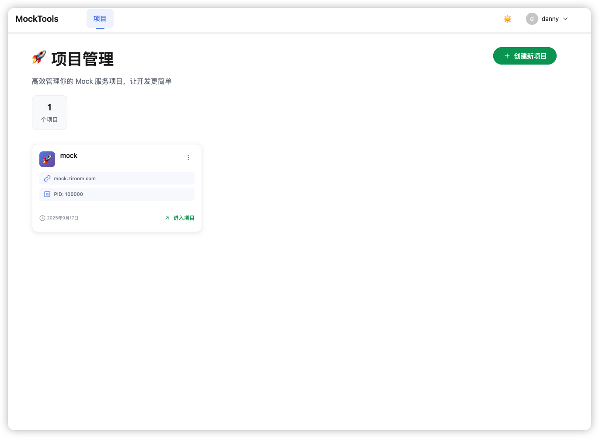

# Mock Tools

## Nuxt 3 Naive UI Tailwind CSS

### 页面





## 安装依赖

```bash
# pnpm
pnpm install
```

## 开发

Start the development server on `http://localhost:6780`:

```bash
# pnpm
pnpm run dev

```

## Production

Build the application for production:
复制 .env.example => .env.prod 然后添加环境变量

```bash
# pnpm
pnpm run build
```

## Docker 部署

[Link](./DEPLOYMENT.md)

## 功能列表

- [x] 登录/注册
- [ ] 个人信息更新
- [x] 项目创建/修改/删除
- [x] api 创建/修改/删除/分页
- [x] api 多数据切换
- [ ] api 数据修改
